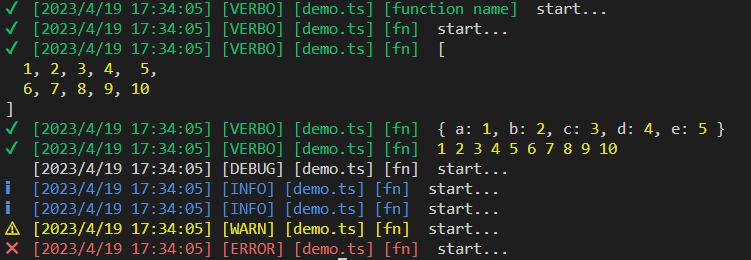

### install
```ts
npm install @171h/log
```

### useage
```ts
import { Logger } from '@171h/log'
const logger = new Logger("demo.ts");

const fn = () => {
  const arr = [1, 2, 3, 4, 5, 6, 7, 8, 9, 10];
  const obj = { a: 1, b: 2, c: 3, d: 4, e: 5}
  logger.verbose("function name", "start...");
  logger.verbose(fn, "start...");
  logger.verbose(fn, arr);
  logger.verbose(fn, obj);
  logger.verbose(fn, ...arr);
  logger.debug(fn, "start...");
  logger.log(fn, "start...");
  logger.info(fn, "start...");
  logger.warn(fn, "start...");
  logger.error(fn, "start...");
};

fn();
```
// output




### config
在项目根目录创建 `log.config.json` 配置日志输出级别，默认 `logLevel` 为 `verbo` 输出所有日志。

#### 日志等级
`verbo < debug < info/log < warn < error < close`

##### 设置日志级别全局为 debug
大于等于 debug 级别的日志会输出
// log.config.json
```
{
  "logLevel": "debug" // 
}
```

##### 设置日志级别全局为 close
关闭所有日志输出
// log.config.json
```
{
  "logLevel": "close"
}
```

#### 为每个 Logger 设置设置日志等级
实例的日志等级优先级高于全局，下面这个 logger 的日志等级为 dubug。
```ts
const logger = new Logger("demo.ts","debug");
```
