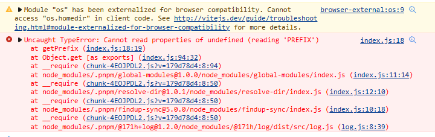

### 2.0.0
- 移除对全局配置文件的读取（暂无法解决在浏览器中打印日志读取全局配置文件的问题）
- 👉

### 1.3.0
- 使用 `fast-glob` 代替了 `findup-sync`,解决 `Module "os" has been externalized for browser compatibility. Cannot access "os.homedir" in client code. See http://vitejs.dev/guide/troubleshooting.html#module-externalized-for-browser-compatibility for more details.`
  

### 1.2.0
- 1.1.0 实际仍为 1.0.0，本次进行了修复（增加了可选配置文件 `log.config.json`）